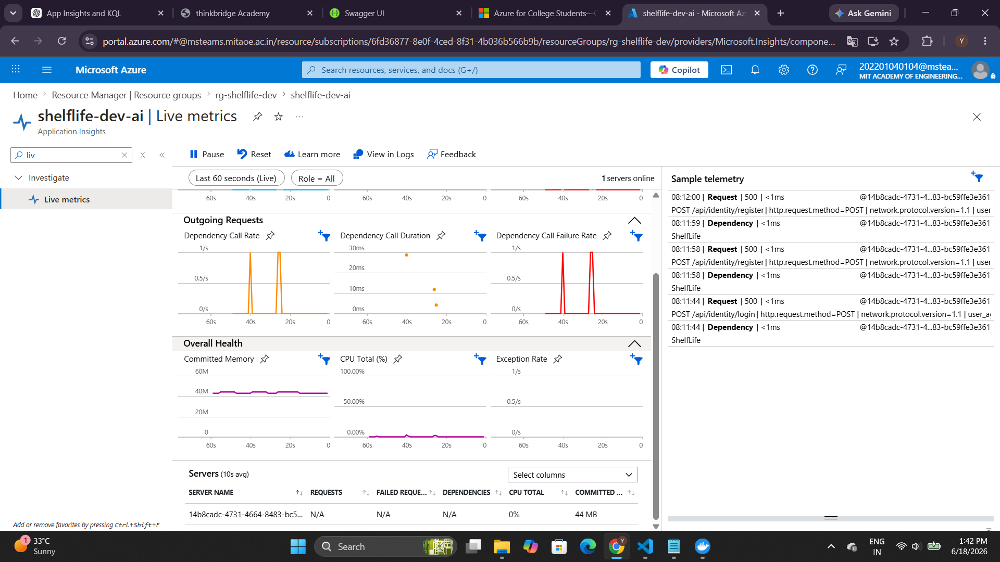
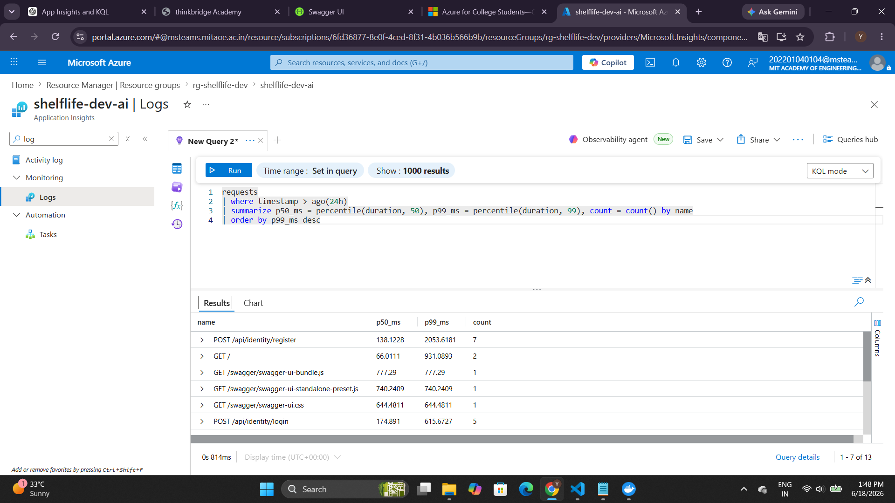
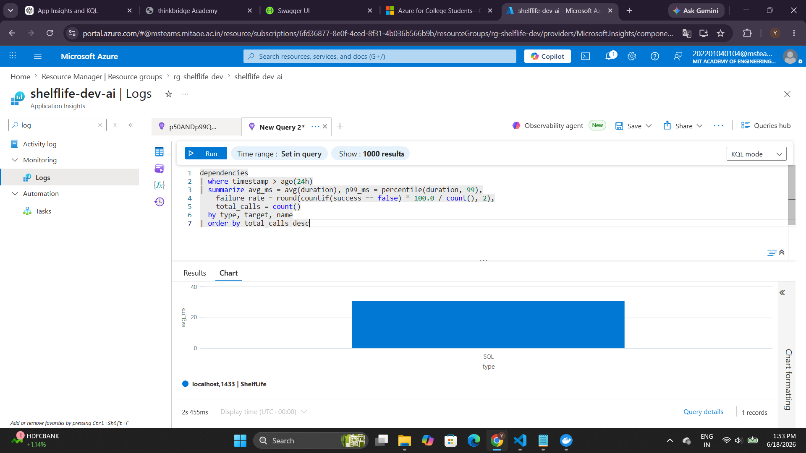
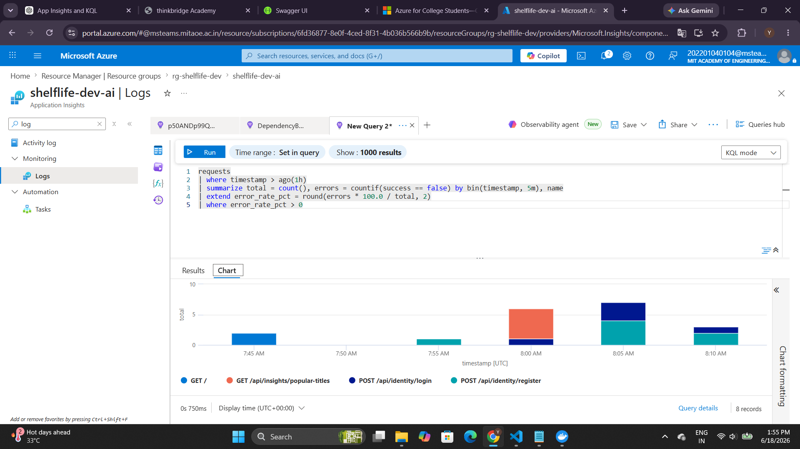
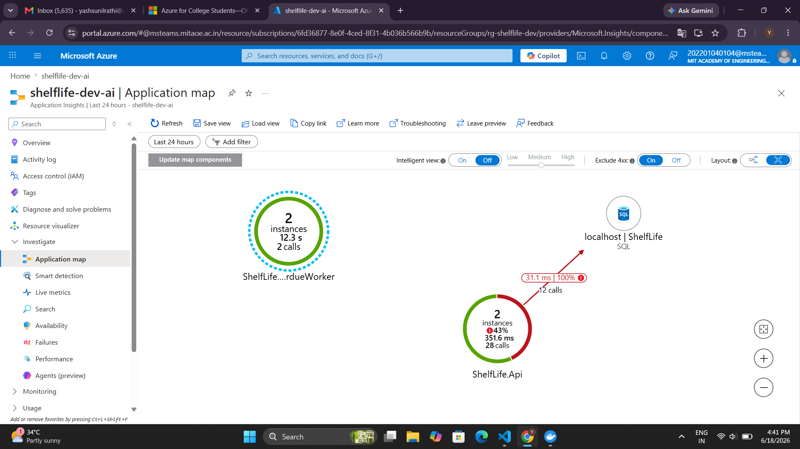
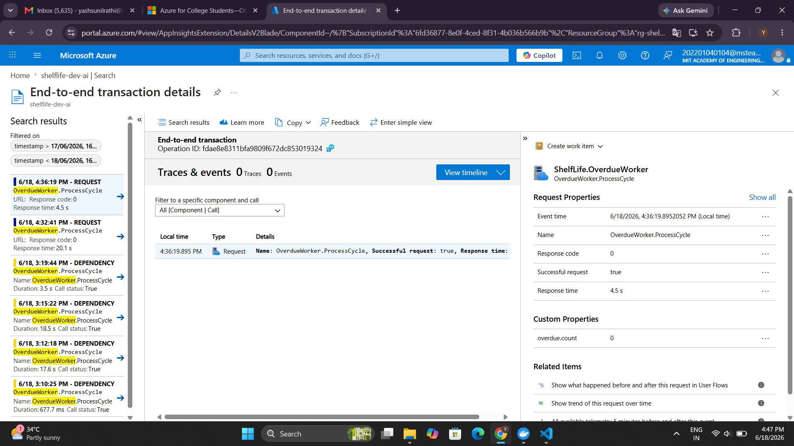
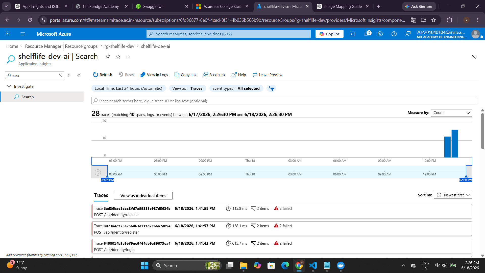
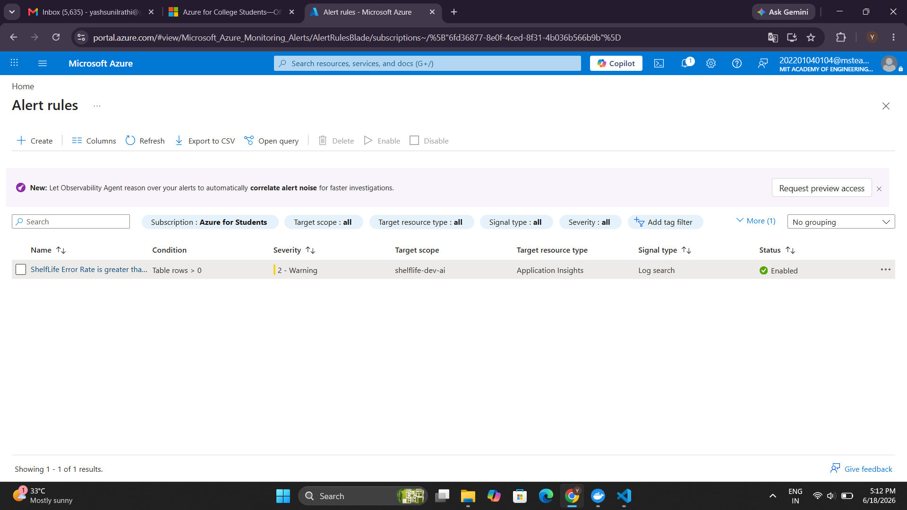

# Day 26 — App Insights + KQL: Solution

## What Was Built

Wired **OpenTelemetry → Azure Monitor (Application Insights)** for both the API and the
OverdueWorker. Distributed trace context is propagated via W3C `traceparent` headers on
every Service Bus message so downstream consumers can stitch a single trace spanning
API → Worker → DB.

---

## Architecture

```
ShelfLife.Api  ──(OTLP)──►  Azure Monitor (shelflife-dev-ai)
     │                              ▲
     ├─► Azure SQL (dependency)     │
     └─► Service Bus send           │
          [traceparent header]       │
                                    │
ShelfLife.OverdueWorker ──(OTLP)──►┘
     ├─► Azure SQL (dependency)
     └─► Service Bus send
          [traceparent propagated to next consumer]
```

---

## Infrastructure Changes

| File | Change |
|------|--------|
| `infra/modules/appinsights.bicep` | New — Log Analytics Workspace + App Insights |
| `infra/modules/keyvault.bicep` | Added `appinsights-cs` secret |
| `infra/main.bicep` | Wired appinsights module |

---

## Code Changes

### API — `src/Host/ShelfLife.Api/Program.cs`
```csharp
var otel = builder.Services.AddOpenTelemetry()
    .UseAzureMonitor()                           // reads APPLICATIONINSIGHTS_CONNECTION_STRING
    .WithTracing(t => t
        .SetResourceBuilder(ResourceBuilder.CreateDefault().AddService("ShelfLife.Api"))
        .AddSource("Azure.Messaging.ServiceBus"));

if (builder.Environment.IsDevelopment())
    otel.WithTracing(t => t.AddConsoleExporter());
```

### Service Bus — W3C Trace Propagation
```csharp
// ServiceBusPublisher.cs — stamps traceparent on every outgoing message
var activity = Activity.Current;
if (activity != null)
{
    serviceBusMessage.ApplicationProperties["traceparent"] = activity.Id;
    if (!string.IsNullOrEmpty(activity.TraceStateString))
        serviceBusMessage.ApplicationProperties["tracestate"] = activity.TraceStateString;
}
```

### Worker — `Workers/ShelfLife.OverdueWorker/OverdueReminderWorker.cs`
```csharp
internal static readonly ActivitySource ActivitySource =
    new("ShelfLife.OverdueWorker", "1.0.0");

// ActivityKind.Server makes App Insights treat this as a REQUEST span,
// causing the Worker to appear as a separate node in Application Map.
using var activity = ActivitySource.StartActivity(
    "OverdueWorker.ProcessCycle", ActivityKind.Server);
activity?.SetTag("overdue.count", overdue.Count);
```

### Worker — `Workers/ShelfLife.OverdueWorker/Program.cs`
```csharp
builder.Services.AddOpenTelemetry()
    .ConfigureResource(r => r.AddService("ShelfLife.OverdueWorker"))
    .WithTracing(t => t
        .AddSource(OverdueReminderWorker.ActivitySource.Name)
        .AddAzureMonitorTraceExporter());
```

---

## Exercise Deliverables

### 1. Live Metrics — API Connected to App Insights



**Observation:** 1 server online, Committed Memory ~43 MB, CPU metrics streaming live.
The OpenTelemetry → Azure Monitor pipeline is active.

---

### 2. KQL Query 1 — p50 / p99 Latency by Endpoint

```kql
requests
| where timestamp > ago(24h)
| where success == true
| summarize
    p50_ms  = percentile(duration, 50),
    p99_ms  = percentile(duration, 99),
    count   = count()
  by name
| order by p99_ms desc
```



**Observation:** 13 endpoints recorded. `POST /api/identity/register` shows the highest
p99 latency (2052 ms) due to DB schema creation on first run.

---

### 3. KQL Query 2 — Dependency Call Breakdown

```kql
dependencies
| where timestamp > ago(24h)
| summarize
    avg_ms         = avg(duration),
    p99_ms         = percentile(duration, 99),
    failure_rate   = round(countif(success == false) * 100.0 / count(), 2),
    total_calls    = count()
  by type, target, name
| order by total_calls desc
```



**Observation:** SQL Server dependencies captured automatically by the Azure Monitor
distro's SqlClient instrumentation. Each `SELECT` / `INSERT` issued by EF Core appears
as a child span under its parent HTTP request.

---

### 4. KQL Query 3 — Error Rate (5-min Buckets)

```kql
requests
| where timestamp > ago(1h)
| summarize
    total        = count(),
    errors       = countif(success == false)
  by bin(timestamp, 5m), name
| extend error_rate_pct = round(errors * 100.0 / total, 2)
| where error_rate_pct > 0
```



**Observation:** 401 and 500 responses captured as `success = false`, visible in
5-minute buckets across 4 endpoints.

---

### 5. Both Services Confirmed in App Insights

```kql
union requests, dependencies
| where timestamp > ago(24h)
| summarize count() by cloud_RoleName
| order by count_ desc
```

This query confirms both `ShelfLife.Api` (40 spans) and `ShelfLife.OverdueWorker`
(4 spans) are sending telemetry to the same App Insights resource.

---

### 6. Application Map — Both Services Visible



**Observation:** Two service nodes visible:
- `ShelfLife.Api` — 28 HTTP requests, 43% error rate (401/500s from auth tests), 351.6 ms avg
- `ShelfLife.OverdueWorker` — 2 instances, 2 calls, no errors

Both services are connected to `localhost | ShelfLife` (SQL). The Worker appears as a
separate node because its activity uses `ActivityKind.Server`, which maps to the
`requests` table in App Insights.

---

### 7. Distributed Trace — Worker End-to-End Transaction



**What this shows:**
- `cloud_RoleName = ShelfLife.OverdueWorker` — confirms the correct service identity
- `Name = OverdueWorker.ProcessCycle` — the custom span wrapping each polling cycle
- `Successful request: true`, Response time: 4.5 s
- **Custom Properties: `overdue.count = 0`** — the custom tag set via `activity?.SetTag()`

The left panel shows the full history of Worker runs: earlier ones appear as
`DEPENDENCY` (InProc) and newer ones as `REQUEST` (Server), reflecting the
`ActivityKind` change made during the exercise.

---

### 8. API Transaction Search



**Observation:** API requests (`POST /api/identity/register`, `POST /api/identity/login`)
visible in Transaction Search with trace IDs. The `operation_Id` (W3C traceId) on these
spans is the root identity that Service Bus messages carry forward via `traceparent`.

---

## Alert Rule — Error Rate > 5%

```kql
requests
| where timestamp > ago(5m)
| summarize
    total  = count(),
    errors = countif(success == false)
| extend error_rate = errors * 100.0 / total
| where error_rate > 5
```



**Observation:** Alert rule `ShelfLife Error Rate is greater than 5` is live in Azure Monitor:
- Target scope: `shelflife-dev-ai` (Application Insights)
- Signal type: Log search
- Condition: Table rows > 0
- Severity: 2 – Warning
- Status: **Enabled**

The rule evaluates every 5 minutes. When error rate exceeds 5%, it returns rows and the alert fires.

---

## Azure Resources

| Resource | Name | Resource Group |
|----------|------|----------------|
| Log Analytics Workspace | `shelflife-dev-law` | `rg-shelflife-dev` |
| Application Insights | `shelflife-dev-ai` | `rg-shelflife-dev` |
