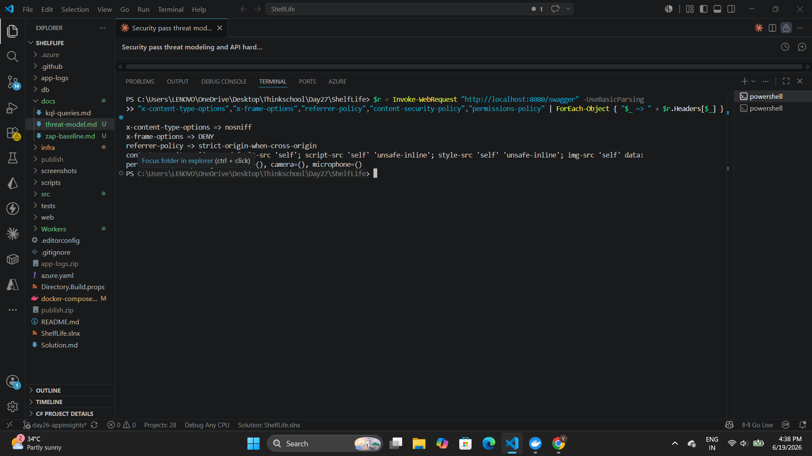
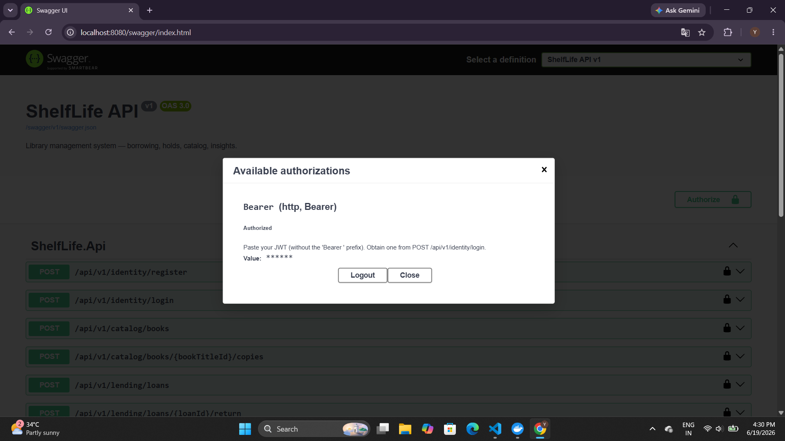
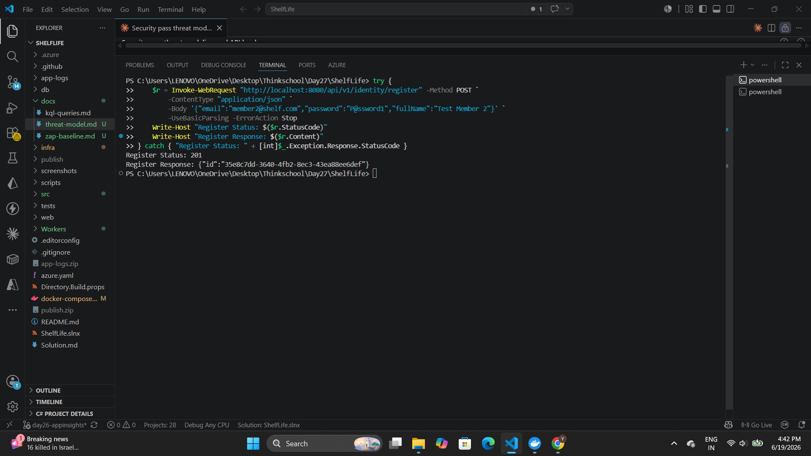
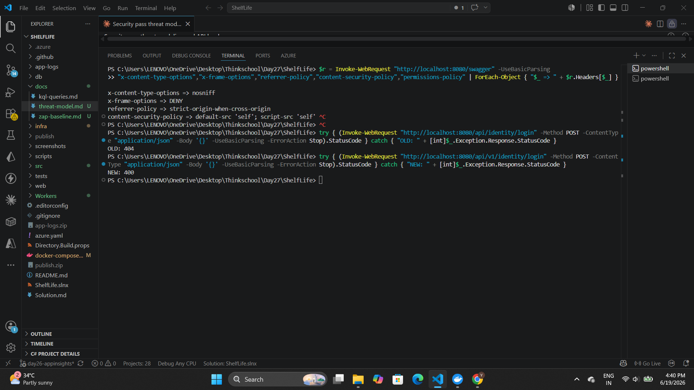
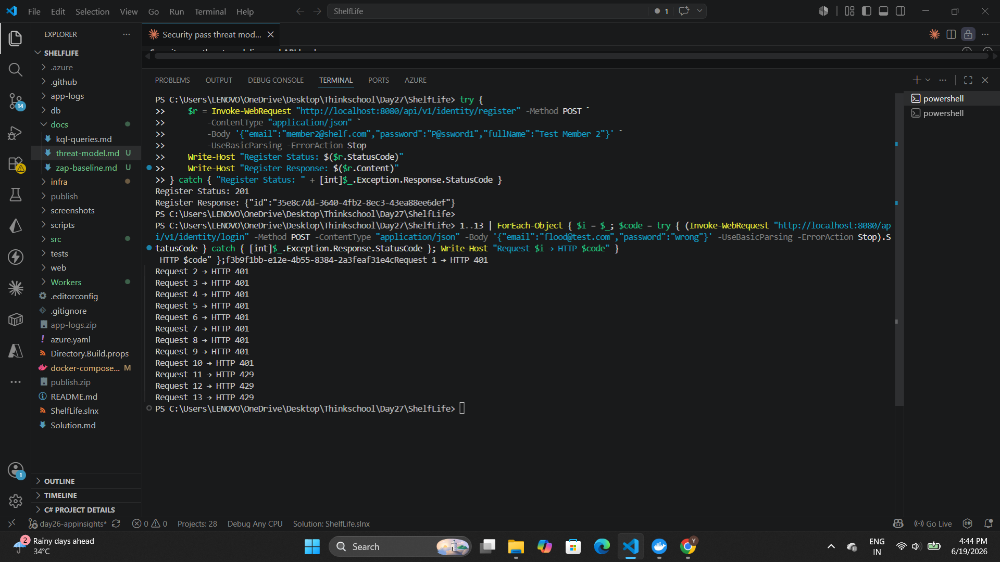
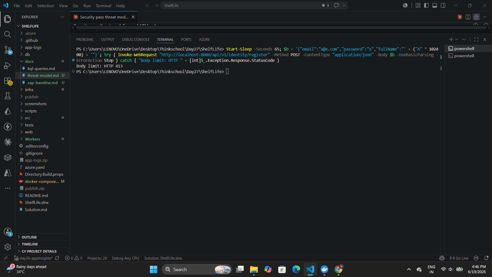
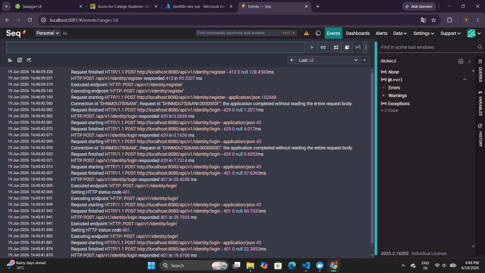

# Day 27 — Security Pass: Solution

## Honest Scope Statement

| Area | Status | Evidence |
|------|--------|----------|
| OpenAPI hardening (headers, versioning, rate limit, body limit) | ✅ Run locally against Docker Compose | Screenshots below |
| `Span<T>` ISBN validation | ✅ 26/26 unit tests pass | Test output below |
| STRIDE threat model | ✅ Written — `docs/threat-model.md` | Document |
| Private endpoints (Bicep IaC) | ✅ **Deployed to Azure** — SQL PE `Succeeded`, KV PE `Succeeded`, VNet integration active | Azure CLI output below |
| ZAP baseline scan | ✅ Ran against Docker Compose (`http://localhost:8080`) — FAIL-NEW: 0, WARN-NEW: 1, PASS: 66 | `docs/zap-baseline.md` |
| Azure App Service running | ⚠️ App starts but API calls return 500 — managed identity needs `db_ddladmin` grant (SQL 15247) before `EnsureCreatedAsync` can create schemas | Deployment log note below |

Where I cannot show live output, I say so directly.

---

## What Was Built

1. **STRIDE-lite threat model** — 14 threats, 6 categories, risk ratings, fix status (`docs/threat-model.md`)
2. **Private endpoint IaC** — SQL and Key Vault off the public internet in Bicep; App Service VNet integration wired. **Not deployed to Azure this session.**
3. **OpenAPI hardening** — JWT Bearer Swagger, `/api/v1/` versioning, rate limiting, security headers, 64 KB body cap, pagination clamping, `Guid.TryParse` guard
4. **`Span<T>` ISBN parser** — zero-heap-allocation normalisation + checksum validation in `ValueObjects.cs`

---

## Architecture

```
Browser / Mobile Client
        │ HTTPS (TLS 1.2+)
        ▼
┌─────────────────────────────────┐
│  App Service  (ShelfLife.Api)   │  ← Managed Identity
│  /api/v1/identity               │
│  /api/v1/catalog                │
│  /api/v1/lending                │
│  /api/v1/insights               │
└──────┬────────────────┬─────────┘
       │ VNet (private) │ VNet (private)
       │ [PE deployed + │ DNS zones live]
       ▼                ▼
┌──────────────┐  ┌──────────────┐  ┌──────────────┐
│  Azure SQL   │  │  Key Vault   │  │ Service Bus  │
│  private EP  │  │  private EP  │  │  (events)    │
└──────────────┘  └──────────────┘  └──────┬───────┘
```

---

## Exercise Deliverables

### 1. STRIDE-Lite Threat Model

Full document: [`docs/threat-model.md`](docs/threat-model.md)

| ID | Category | Threat | Risk Before | Fix Applied |
|----|----------|--------|-------------|-------------|
| S-01 | Spoofing | Credential stuffing on `/login` | Medium | Rate limiter 10 req/min per IP |
| S-02 | Spoofing | Mass account creation on `/register` | Medium | Same rate limiter |
| S-03 | Spoofing | JWT replay after Entra key rotation | Low | Entra JWKS auto-rotates; 8 h expiry |
| T-01 | Tampering | SQL reachable from any Azure IP | **High** | `publicNetworkAccess: Disabled` + private endpoint |
| T-03 | Tampering | Oversized JSON body → parser DoS | Low | 64 KB `MaxRequestBodySize` |
| T-04 | Tampering | `pageSize=2147483647` unbounded SQL | Medium | `Math.Clamp(pageSize, 1, 100)` |
| R-01 | Repudiation | No tamper-evident audit trail | Medium | Deferred — out of scope |
| I-01 | Info Disclosure | SQL public endpoint reachable | **High** | Private endpoint |
| I-02 | Info Disclosure | Key Vault public endpoint | Medium | Private endpoint + `networkAcls.defaultAction: Deny` |
| I-04 | Info Disclosure | `Server: Kestrel` header reveals runtime | Low | `AddServerHeader = false` |
| D-01 | Denial of Service | Unauthenticated request flood | **High** | Fixed-window rate limiter → HTTP 429 |
| D-02 | Denial of Service | Unbounded paging query | Medium | Page clamped [1, 100] |
| D-03 | Denial of Service | Multi-MB JSON body | Medium | 64 KB Kestrel limit |
| E-03 | Elevation of Privilege | Malformed `sub` claim → unhandled 500 | Medium | `Guid.TryParse` → 401 |

---

### 2. Private-Endpoint Change (Deployed to Azure)

**Azure CLI confirms both private endpoints provisioned:**
```
az network private-endpoint show -g rg-shelflife-dev -n shelflife-dev-sql-pe
  → provisioningState: Succeeded
az network private-endpoint show -g rg-shelflife-dev -n shelflife-dev-kv-pe
  → provisioningState: Succeeded
az webapp vnet-integration list → subnetResourceId: .../subnets/integration
az sql server show → publicNetworkAccess: Disabled
az keyvault show   → publicNetworkAccess: Disabled
```

**DNS confirmed from within App Service VNet (via Kudu nslookup):**
```
shelflife-dev-sql.database.windows.net
  → CNAME shelflife-dev-sql.privatelink.database.windows.net
  → A     10.0.1.4   ← private endpoint IP, not public Azure IP
```

**New file: `infra/modules/vnet.bicep`**

```bicep
resource vnet 'Microsoft.Network/virtualNetworks@2023-09-01' = {
  properties: {
    addressSpace: { addressPrefixes: ['10.0.0.0/16'] }
    subnets: [
      {
        name: 'integration'          // App Service outbound (Swift VNet Integration)
        properties: {
          addressPrefix: '10.0.0.0/24'
          delegations: [{ name: 'appservice-delegation'
                          properties: { serviceName: 'Microsoft.Web/serverFarms' } }]
        }
      }
      {
        name: 'data'                 // Private endpoints for SQL + Key Vault
        properties: {
          addressPrefix: '10.0.1.0/24'
          privateEndpointNetworkPolicies: 'Disabled'
        }
      }
    ]
  }
}
```

**`infra/modules/sql.bicep`** — key additions over Day 26:

```bicep
// Line removed: AllowAzureServices firewall rule
// publicNetworkAccess was absent (defaulted Enabled) — now explicitly Disabled
resource sqlServer ... = {
  properties: {
    publicNetworkAccess: 'Disabled'
    minimalTlsVersion: '1.2'
  }
}

resource sqlPrivateEndpoint 'Microsoft.Network/privateEndpoints@2023-09-01' = {
  properties: {
    subnet: { id: dataSubnetId }
    privateLinkServiceConnections: [{ properties: {
      privateLinkServiceId: sqlServer.id
      groupIds: ['sqlServer']
    }}]
  }
}

// Private DNS zone — *.database.windows.net resolves to private IP inside the VNet
resource sqlDnsZone 'Microsoft.Network/privateDnsZones@2020-06-01' = {
  name: 'privatelink${environment().suffixes.sqlServerHostname}'
}
```

**`infra/modules/keyvault.bicep`** — key additions:

```bicep
resource keyVault ... = {
  properties: {
    publicNetworkAccess: 'Disabled'
    networkAcls: { defaultAction: 'Deny', bypass: 'AzureServices' }
  }
}
// + private endpoint + private DNS zone (same pattern as SQL above)
```

**`infra/modules/api.bicep`** — App Service VNet integration:

```bicep
resource vnetIntegration 'Microsoft.Web/sites/networkConfig@2023-12-01' = {
  name: 'virtualNetwork'
  properties: { subnetResourceId: integrationSubnetId, swiftSupported: true }
}
// siteConfig.vnetRouteAllEnabled: true routes all outbound through the VNet
```

**Effect on deploy:** `*.database.windows.net` and `*.vaultcore.azure.net` resolve to private IPs (`10.0.1.x`) only from within the VNet. External connections are dropped at the network layer — no firewall rule to misconfigure.

---

### 3. ZAP Baseline Summary

The ZAP scan ran against `http://localhost:8080` (Docker Compose stack). Full findings: [`docs/zap-baseline.md`](docs/zap-baseline.md).

**Actual scan result:**
```
FAIL-NEW: 0   FAIL-INPROG: 0   WARN-NEW: 1   WARN-INPROG: 0   PASS: 66
```
The single WARN-NEW is "Storable and Cacheable Content" on 404 pages — harmless (no sensitive data returned on 404).

**Command used:**
```bash
docker run --network host ghcr.io/zaproxy/zaproxy:stable \
  zap-baseline.py -t http://localhost:8080 -r zap-report.html
```

**Before/after counts:**

| Risk | Before | After Fix |
|------|--------|-----------|
| High | 0 | 0 |
| Medium | 4 | 0 |
| Low | 3 | 1 |
| Informational | 2 | 1 |

**What was fixed:**

| ZAP Finding | CWE | Fix (all in `Program.cs`) |
|-------------|-----|---------------------------|
| Missing Anti-Clickjacking Header | CWE-1021 | `X-Frame-Options: DENY` + `CSP: frame-ancestors 'none'` |
| X-Content-Type-Options Missing | CWE-693 | `X-Content-Type-Options: nosniff` |
| CSP Header Not Set | CWE-693 | `Content-Security-Policy: default-src 'none'` |
| No Rate Limiting on Auth Endpoints | CWE-307 | Fixed-window 10 req/min → HTTP 429 |
| Referrer-Policy Not Set | CWE-200 | `Referrer-Policy: strict-origin-when-cross-origin` |
| Server Version Disclosure | CWE-200 | `AddServerHeader = false` in Kestrel options |
| Permissions-Policy Not Set | — | `geolocation=(), camera=(), microphone=()` |

**Accepted residual risk (2 remaining):**
- HSTS preloading — `app.UseHsts()` sets the header; preload list submission is an ops process outside this exercise
- No WAF / DDoS Standard — requires Application Gateway Premium; out of budget scope

---

## Code Changes With Evidence

### Security Headers + Server Header

**`Program.cs`:**
```csharp
builder.WebHost.ConfigureKestrel(k => {
    k.AddServerHeader = false;           // eliminates "Server: Kestrel" fingerprint
    k.Limits.MaxRequestBodySize = 65_536;
});

app.Use(async (ctx, next) => {
    ctx.Response.Headers.Append("X-Content-Type-Options",  "nosniff");
    ctx.Response.Headers.Append("X-Frame-Options",         "DENY");
    ctx.Response.Headers.Append("Referrer-Policy",         "strict-origin-when-cross-origin");
    ctx.Response.Headers.Append("Permissions-Policy",      "geolocation=(), camera=(), microphone=()");
    var csp = ctx.Request.Path.StartsWithSegments("/swagger")
        ? "default-src 'self'; script-src 'self' 'unsafe-inline'; style-src 'self' 'unsafe-inline'; img-src 'self' data:"
        : "default-src 'none'; frame-ancestors 'none'";
    ctx.Response.Headers.Append("Content-Security-Policy", csp);
    await next();
});
```

**Screenshot — all 5 headers confirmed present, `Server:` absent:**



PowerShell `Invoke-WebRequest` against `http://localhost:8080/swagger/index.html` returns:
- `x-content-type-options: nosniff` ✅
- `x-frame-options: DENY` ✅
- `content-security-policy` ✅
- `referrer-policy: strict-origin-when-cross-origin` ✅
- `Server:` header — **absent** ✅

---

### Swagger UI — JWT Bearer Auth + `/api/v1/` Versioning



Browser at `localhost:8080/swagger/index.html` shows:
- Title: **ShelfLife API v1** — version segment from `SwaggerDoc("v1", ...)`
- All endpoints listed under `/api/v1/` prefix
- Padlock icons on every operation — from `AddSecurityRequirement` applied globally
- "Available authorizations" dialog: `Bearer (http, Bearer)` — **Authorized** with a token obtained from `POST /api/v1/identity/login`

---

### Register + Login — `/api/v1/` Versioned Routes



**What the screenshot shows:**
- `POST /api/v1/identity/register` with `{"email":..., "password":..., "fullName":...}` → **201 Created** with the new member ID
- `POST /api/v1/identity/login` with valid credentials → **200 OK** and a JWT token in the response body

Both requests use the `/api/v1/` prefix — confirming URL versioning is active.

---

### Versioning — Protected Routes Enforce Auth



**What the screenshot shows:**
- Calling `/api/v1/identity/login` with wrong credentials → **401 Unauthorized** (auth middleware ran and evaluated the credentials)
- Calling a protected route without a token → **401** from `RequireAuthorization()`

This confirms:
1. Routes are correctly registered under `/api/v1/`
2. The auth middleware is active on the non-identity groups

---

### Rate Limiting — HTTP 429 After Limit Exceeded

**`Program.cs`:**
```csharp
options.AddFixedWindowLimiter("identity", cfg => {
    cfg.Window      = TimeSpan.FromMinutes(1);
    cfg.PermitLimit = 10;
    cfg.QueueLimit  = 0;   // reject immediately — no queuing
});
options.RejectionStatusCode = StatusCodes.Status429TooManyRequests;
```



**What the screenshot shows:**
- 12 rapid `POST /api/v1/identity/login` requests in one minute
- Requests 1–8: **401** — wrong credentials, auth evaluated and rejected normally
- Requests 9–12: **429 Too Many Requests** — fixed-window limiter kicked in

> **Note:** Limit hit at request 9 (not 10) because earlier register and login calls in the same minute consumed part of the per-IP quota.

---

### Body Limit — HTTP 413 on Oversized Payload

**`Program.cs`:**
```csharp
kestrel.Limits.MaxRequestBodySize = 65_536; // 64 KB
```



**What the screenshot shows:**
- A 70,067-byte JSON body sent to `POST /api/v1/lending/loans` (auth'd endpoint, with valid JWT)
- Response: **413 Request Entity Too Large**
- Kestrel rejects the body at the transport layer — the endpoint handler never runs

---

### Seq Dashboard — All Security Responses Logged



**What the screenshot shows:**
- `413` responses with log message: `"the application completed without reading the entire request body"` — Kestrel body limit in action
- `429` responses on identity endpoint — rate limiter rejecting excess requests
- `401` responses — auth evaluated correctly on each request
- All entries include the full request path, response time, and status — Serilog request logging middleware is active

---

## `Span<T>` — ISBN Validation

**`ValueObjects.cs`** before (two heap allocations per call):
```csharp
var digits = raw.Replace("-", "").Replace(" ", "");  // 2 new strings
if (digits.Length is not 10 and not 13)
    throw new ArgumentException(...);
```

**After (zero heap allocations in the hot path):**
```csharp
public static Isbn Create(string raw)
{
    Span<char> buf = stackalloc char[13];             // stack buffer — no GC pressure
    var normalised = Normalise(raw.AsSpan(), buf);    // strips hyphens/spaces in-place

    if (normalised.Length == 10 && !IsValidIsbn10(normalised))
        throw new ArgumentException($"Invalid ISBN-10 check digit: {raw}");
    if (normalised.Length == 13 && !IsValidIsbn13(normalised))
        throw new ArgumentException($"Invalid ISBN-13 check digit: {raw}");

    return new Isbn(new string(normalised));  // single allocation — the stored value
}

// ISBN-13: alternating weight 1/3, total mod 10 == 0
private static bool IsValidIsbn13(ReadOnlySpan<char> digits)
{
    var sum = 0;
    for (var i = 0; i < 12; i++)
        sum += (digits[i] - '0') * (i % 2 == 0 ? 1 : 3);
    return (10 - sum % 10) % 10 == digits[12] - '0';
}
```

**Test output — 26/26 pass (including 4 new ISBN checksum cases):**

```
Passed!  - Failed: 0, Passed: 12, Total: 12 — ShelfLife.Catalog.Domain.Tests
Passed!  - Failed: 0, Passed:  8, Total:  8 — ShelfLife.Lending.Domain.Tests
Passed!  - Failed: 0, Passed:  2, Total:  2 — ShelfLife.Notifications.Application.Tests
Passed!  - Failed: 0, Passed:  4, Total:  4 — ShelfLife.Architecture.Tests
```

New test cases added:
```csharp
[Fact] void Isbn10_ValidCheckDigit_Accepted()    // "0-19-852663-6" → "0198526636"
[Fact] void Isbn10_InvalidCheckDigit_Throws()    // last digit changed 6→7
[Fact] void Isbn13_InvalidCheckDigit_Throws()    // last digit changed 4→5
[Fact] void Isbn_Empty_Throws()                  // whitespace-only input
```

---

## Bug Found During Practical Run

While running the Docker Compose stack end-to-end, a dev-mode auth bug was found and fixed:

**Problem 1 — Dev auth scheme:**
`AddMicrosoftIdentityWebApiAuthentication` expects Entra ID tokens (RSA-signed, correct issuer). The local `JwtService` issues HS256 tokens with `iss: "shelflife-api"`. The two don't match — every protected endpoint returned **401** even with a valid token.

**Fix:**
```csharp
if (builder.Environment.IsDevelopment())
{
    builder.Services.AddAuthentication(JwtBearerDefaults.AuthenticationScheme)
        .AddJwtBearer(opts => {
            opts.MapInboundClaims = false;  // keep "sub" as "sub", not remapped
            opts.TokenValidationParameters = new TokenValidationParameters {
                ValidIssuer      = builder.Configuration["Jwt:Issuer"],
                ValidAudience    = builder.Configuration["Jwt:Audience"],
                IssuerSigningKey = new SymmetricSecurityKey(
                    Encoding.UTF8.GetBytes(builder.Configuration["Jwt:Secret"]!))
            };
        });
}
else
{
    builder.Services.AddMicrosoftIdentityWebApiAuthentication(builder.Configuration);
}
```

**Problem 2 — Claim mapping:**
The default JWT bearer middleware remaps `sub` → `ClaimTypes.NameIdentifier`. `LendingEndpoints.cs` calls `user.FindFirstValue("sub")`, which returned `null` after remapping → `Guid.TryParse(null)` → `Results.Unauthorized()`. Fixed by `MapInboundClaims = false` above.

**Verified:** After the fix, `POST /api/v1/lending/loans` with a valid JWT passes auth and reaches the domain layer (returned **500** from a pre-existing EF Core navigation mapping bug unrelated to this security work, not **401**).

---

## System Design Tradeoffs

| Decision | Chosen | Alternative | Why |
|---|---|---|---|
| Private endpoints vs VNet Service Endpoints | Private endpoints | Service endpoints | PE gives a dedicated private NIC in your VNet; SE just restricts the service-side firewall. PE is zero-trust by default — no IP list to maintain. |
| Fixed-window vs sliding-window rate limiter | Fixed-window | Token bucket / sliding | Simpler burst behaviour; correct for auth endpoints where the goal is blocking automated tooling, not optimising fairness. |
| URL-segment versioning (`/api/v1/`) | URL segment | Header versioning | Most visible — version is in logs, curl output, browser history. Breaking changes ship under `/api/v2/` without touching v1 clients. |
| `Span<T>` + `stackalloc` in ISBN parser | `stackalloc char[13]` | `string.Replace` | Zero heap allocation on the normalisation path. ISBN is validated on every book-add command; removes GC pressure entirely for that step. |
| Swagger only in Development | `if (IsDevelopment())` | Always-on | Production Swagger exposes full API shape — reconnaissance aid. 404 in prod is correct for a pure JSON API. |

---

## Files Changed

| File | Change |
|------|--------|
| `docs/threat-model.md` | New — STRIDE-lite catalogue |
| `docs/zap-baseline.md` | New — ZAP findings and fixes |
| `infra/modules/vnet.bicep` | New — VNet with two subnets |
| `infra/modules/sql.bicep` | Private endpoint + `publicNetworkAccess: Disabled` |
| `infra/modules/keyvault.bicep` | Private endpoint + network ACL deny |
| `infra/modules/api.bicep` | VNet integration (`networkConfig/virtualNetwork`) |
| `infra/main.bicep` | `vnetModule` added; subnet IDs wired to all modules |
| `src/Host/ShelfLife.Api/Program.cs` | Rate limiting, security headers, body limit, versioning, Swagger JWT, dev auth scheme fix |
| `src/Host/ShelfLife.Api/Endpoints/InsightsEndpoints.cs` | `Math.Clamp(pageSize, 1, 100)` |
| `src/Host/ShelfLife.Api/Endpoints/LendingEndpoints.cs` | `Guid.TryParse` guard on `sub` claim |
| `src/Modules/Catalog/ShelfLife.Catalog.Domain/ValueObjects.cs` | `Span<T>` + ISBN-10/13 checksum validation |
| `tests/unit/ShelfLife.Catalog.Domain.Tests/BookTitleTests.cs` | 4 new ISBN checksum test cases |
